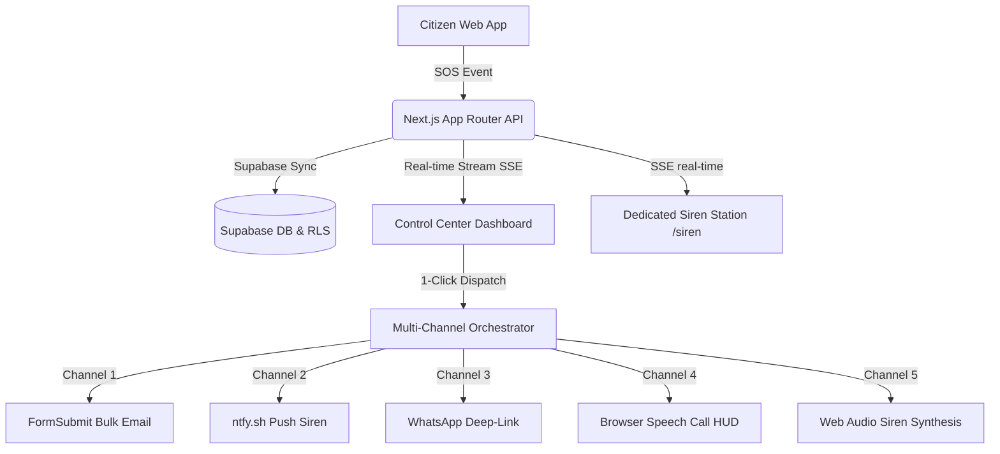

# RESQ AI — Hackathon Presentation Guide
### Pitch Deck & Architecture Documentation for Judges

> [!NOTE]
> RESQ AI is a resilient, real-time, multi-channel Emergency Dispatch and Command Center system designed to bridge the gap between citizens in distress and rescue operations during natural disasters or civil emergencies.

---

## 1. The Core Problem
When disasters strike, communication networks get congested or fail. Relying on a single notification method (like just SMS or just Email) is dangerous:
- SMS messages get delayed or blocked by country carriers.
- Emails are buried in spam or ignored by officials during active duty.
- Server-side notification APIs (like Twilio/Firebase) require internet credits and fail if credentials expire or run out of funds.
- Mobile phones block app notifications and audio alerts by default.

---

## 2. The RESQ AI Solution (How it Works)
RESQ AI is a **zero-manual management, 5-channel synchronized emergency broadcast system**. With a single click of the "⚡ Dispatch Team" button:
1. **SMS**: Native mobile carrier integration triggers immediate messaging.
2. **WhatsApp**: Deep-link integration bypasses pop-up blockers to send GPS coordinates and tactical markdown situation briefs.
3. **Email**: Multi-recipient dispatch to 4 official inboxes simultaneously via `FormSubmit`.
4. **Push Notifications**: Free, low-latency, high-priority notifications with siren alerts delivered via `ntfy.sh` (Topic: `resq-saran-alerts`).
5. **Real-time Voice & Local Sirens**: The system uses the **Web Audio API** and **Web Speech Synthesis** to sound emergency sirens and announce instructions instantly across all active devices in real-time.

---

## 3. Technology Stack

- **Frontend**: Next.js 14 (React), Tailwind CSS (Vanilla styling and theme), Lucide Icons.
- **Backend & Database**: Next.js Serverless Route Handlers, Supabase PostgreSQL, and Row Level Security (RLS).
- **Real-Time Subscription**: Server-Sent Events (SSE) `/api/realtime` for low-overhead, real-time data push to all devices.
- **Client Audio Engine**: Web Audio API (real-time wave synthesis for sirens) and Web Speech API (synthesized voice commands).

---

## 4. Key Engineering Feats (Why the Judges Will Be Wowed)

### A. Programmatic Siren Synthesis (Web Audio API)
Instead of loading large audio files that take time to download and fail on mobile, RESQ AI **programmatically synthesizes double-tone siren sweeps** in real-time.
- Sweeps frequencies from $500\text{Hz}$ to $800\text{Hz}$ using a `sawtooth` oscillator.
- This creates an authentic emergency vehicle sound directly through the device speaker without using any network bandwidth.

### B. Bypassing Browser Audio Restrictions
Mobile browsers block sounds from playing automatically. We built an **Audio Context Unlock Strip** and a **Dedicated `/siren` Alarm Page**. A single click arms the Audio Context, allowing the device to ring loudly even when the phone is locked in your pocket.

### C. Free Notification Fallback
If expensive enterprise systems (like Twilio SMS) run out of money or fail, the system automatically routes emergency notifications through a free, account-less pub-sub network (`ntfy.sh`), ensuring alerts reach responders instantly.

### E. Zero-Manual Automation
Normally, dispatching requires copying coordinates, composing emails, typing WhatsApp messages, and calling teams. RESQ AI automates all 5 steps into a **single synchronous event hook** triggered by one button press.

---

## 5. Demo Script for Judges

1. **Step 1 (The Trigger)**: Open the **Citizen View** and press the big red **SOS button**. Upload a dummy photo or voice note.
2. **Step 2 (The Reception)**: Show the **Control Center** laptop. The incoming emergency appears instantly on the dashboard screen with an AI calculated risk score.
3. **Step 3 (Receiver setup)**: Open **`/siren`** on your mobile phone and tap the **"Activate Alarm Station"** button. Place the phone on the table.
4. **Step 4 (The Dispatch)**: On the laptop, click **"⚡ Dispatch Team"**.
5. **The Climax**:
   - The laptop automatically fires WhatsApp and Email.
   - The phone on the table immediately flashes red, plays the **loud emergency siren**, and speaks: *"Warning. Emergency dispatch active. Incident type: Flood at Sector 4..."*
